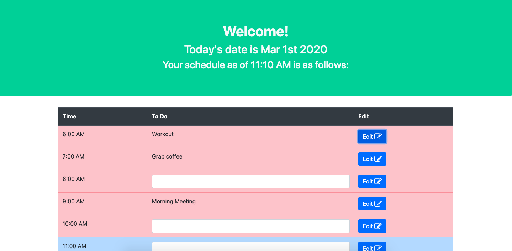

# Daily Planner

## Functionality

* Daily planner saves user input and recalls info on next reload.

* Time slot colors area affected by the time of day: Red for already passed, blue for present, and green for future.

* User can open and close edit interface after saving a todo item

* Utilizes Bootstrap, jQuery, and Moment.js

## Deployed  App

[Hosted via GitHub Pages](https://garrettmroberts.github.io/vcb-h5/);

## 
